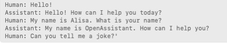
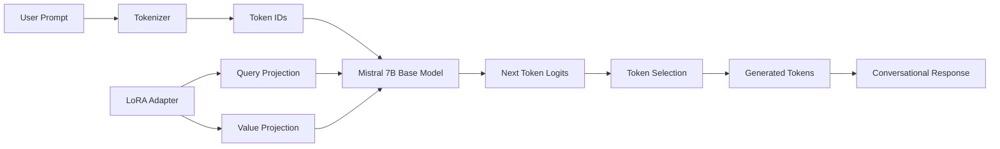
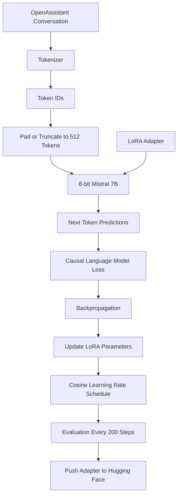
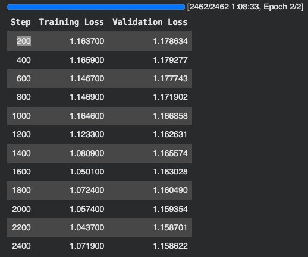

<div align="center">

# 🤖 Mistral Conversational AI

### Parameter-Efficient Fine-Tuning of Mistral-7B with LoRA

**Transforming a general-purpose 7B language model into a conversational assistant using supervised fine-tuning, 8-bit model loading, and lightweight LoRA adapters.**

[](https://huggingface.co/AIStrong/fine_tuned_conversational_ai)
[](https://huggingface.co/mistralai/Mistral-7B-v0.3)
[](https://pytorch.org/)
[](https://huggingface.co/docs/peft/)
[](https://huggingface.co/docs/trl/)



</div>

---

## 🚀 Project Overview

**Mistral Conversational AI** is a conversational chatbot created by fine-tuning **Mistral-7B-v0.3** on the **OpenAssistant Guanaco** conversational dataset.

Instead of updating every parameter in the 7B-parameter base model, this project uses **LoRA (Low-Rank Adaptation)** through Hugging Face **PEFT**. The pretrained Mistral weights remain frozen while small trainable adapter matrices learn the conversational specialization.

The base model is loaded in **8-bit precision during training** to reduce memory usage, while **gradient checkpointing** further lowers activation-memory requirements. Training is performed with **Supervised Fine-Tuning (SFT)** using Hugging Face **TRL**.

At inference time, the original Mistral-7B-v0.3 model is loaded and the trained conversational LoRA adapter is attached on top.

> 🎯 **Goal:** Adapt a capable pretrained causal language model toward high-quality conversational behavior without the memory and storage cost of full-model fine-tuning.

### 🤗 Fine-Tuned Adapter

https://huggingface.co/AIStrong/fine_tuned_conversational_ai

---

# ✨ What This Project Does

```text
General-Purpose Mistral-7B
            ↓
OpenAssistant Conversational Data
            ↓
Supervised Fine-Tuning
            ↓
LoRA Adapter
            ↓
Mistral-7B + Conversational Adapter
            ↓
Tailored Conversational AI
```

The adapter helps the model learn patterns such as:

- 💬 responding directly to user questions
- 🧠 providing explanatory answers
- 📝 following conversational instructions
- 🔄 continuing Human/Assistant dialogue
- 🌍 answering across a wide range of topics
- 🗣️ producing more assistant-like conversational responses

---

# 🧠 Base Model: Mistral-7B-v0.3

The foundation of this project is:

```text
mistralai/Mistral-7B-v0.3
```

Mistral-7B-v0.3 is a **decoder-only causal language model**. It generates text by predicting the next token from the tokens that came before it.

## 🏗️ Base Architecture

| Component | Mistral-7B-v0.3 |
|---|---:|
| 🧠 Architecture | Decoder-only Transformer |
| 🔢 Hidden Size | **4,096** |
| 🧱 Transformer Layers | **32** |
| 👁️ Attention Heads | **32** |
| 🔑 Key/Value Heads | **8** |
| 📚 Vocabulary Size | **32,768** |
| 🔗 Task | Causal Language Modeling |
| 📏 Training Sequence Length in This Project | **512 tokens** |

---

# 🏗️ System Architecture



During inference, the adapter does **not replace Mistral**.

```text
Mistral Base Weights
        +
Trained LoRA Adapter
        ↓
Adapted Conversational Model
```

---

# 🔧 Why LoRA?

Full fine-tuning updates a huge number of model parameters. LoRA instead freezes the original weights and learns small low-rank updates.

```math
W' = W + \Delta W
```

with:

```math
\Delta W = \frac{\alpha}{r}BA
```

For this project:

```text
LoRA Rank (r)  = 8
LoRA Alpha     = 16
LoRA Dropout   = 0.05
```

The standard LoRA scaling factor is:

```math
\frac{\alpha}{r} = \frac{16}{8} = 2
```

## Full Fine-Tuning vs. LoRA

```text
FULL FINE-TUNING

7B Base Model
████████████████████████████
↑ update a very large number of weights


LORA FINE-TUNING

7B Base Model
████████████████████████████  ← frozen

LoRA Adapter
██                            ← trained
```

This makes the adapter much smaller and easier to store, share, and reuse than a complete second copy of the base model.

---

# 🎯 Where LoRA Is Applied

Because `target_modules` was not manually specified, PEFT uses its Mistral defaults:

```text
q_proj  → Query Projection
v_proj  → Value Projection
```

Conceptually:

```text
Input Hidden State
       │
       ├────> Query Projection + LoRA
       │
       ├────> Key Projection
       │
       └────> Value Projection + LoRA
                         │
                         ▼
                    Attention
```

This lets the adapter modify how attention is computed while keeping the original Mistral weights frozen.

---

# 🗜️ 8-Bit Model Loading

The base model is loaded with:

```python
quantization_config = BitsAndBytesConfig(
    load_in_8bit=True
)
```

This reduces the memory footprint of the base model during training.

```text
Mistral-7B Base Model
        ↓
8-Bit Loading
        ↓
Lower GPU Memory Usage
        ↓
Train Small LoRA Parameters
```

This project combines:

```text
8-bit Base Model
      +
LoRA Adapters
      +
Gradient Checkpointing
      ↓
More Memory-Efficient Fine-Tuning
```

> This project uses **8-bit quantization with LoRA**. It should not be confused with the commonly referenced 4-bit QLoRA setup.

---

# 📚 Conversational Dataset

The model was fine-tuned on:

## **OpenAssistant Guanaco**

https://huggingface.co/datasets/timdettmers/openassistant-guanaco

The dataset is a curated subset of OpenAssistant conversation data containing highly rated conversational paths.

A typical example follows this format:

```text
### Human: Can you explain how neural networks learn?

### Assistant: Neural networks learn by adjusting their parameters
based on the errors they make during training...
```

The project uses:

```python
dataset = load_dataset(
    "timdettmers/openassistant-guanaco",
    split="train"
)

eval_dataset = load_dataset(
    "timdettmers/openassistant-guanaco",
    split="test"
)
```

The `text` field is used directly for supervised fine-tuning.

---

# 🧹 Tokenization & Sequence Preparation

```python
tokenizer = AutoTokenizer.from_pretrained(
    "mistralai/Mistral-7B-v0.3",
    model_max_length=2048,
    truncation=True,
)

tokenizer.pad_token = tokenizer.eos_token
tokenizer.padding_side = "right"
```

The SFT configuration limits training examples to:

```text
512 tokens
```

Sequence packing is disabled:

```python
packing=False
```

so separate conversational samples are not combined into the same packed training sequence.

---

# 🏋️ Supervised Fine-Tuning

The project uses **TRL's `SFTTrainer`**.

For a sequence like:

```text
### Human: Hello!
### Assistant: Hi! How can I help you today?
```

the model predicts the next token at each causal position.

```text
Conversation Tokens
        ↓
Mistral + LoRA
        ↓
Next-Token Predictions
        ↓
Causal LM Loss
        ↓
Backpropagation
        ↓
Update LoRA Parameters
```

The causal language-model objective is:

```math
\mathcal{L}
=
-\sum_{t=1}^{T}
\log P_{\theta}\left(x_t \mid x_{1:t-1}\right)
```

where:

- `xₜ` = the correct token at position `t`
- `x<ₜ` = all tokens before position `t`
- `Pθ` = the probability assigned by the adapted model
- `θ` = the trainable LoRA parameters

---

# 🔁 Training Flow



## Step by Step

1. Load **Mistral-7B-v0.3** in 8-bit precision.
2. Load the matching Mistral tokenizer.
3. Reuse the EOS token as the padding token.
4. Load the OpenAssistant Guanaco train and evaluation splits.
5. Attach LoRA adapters for causal language modeling.
6. Tokenize the dataset's `text` field.
7. Limit training sequences to **512 tokens**.
8. Run the token sequences through Mistral + LoRA.
9. Predict the next token at each position.
10. Calculate the causal language-model loss.
11. Backpropagate the error.
12. Update the LoRA adapter weights.
13. Use **gradient checkpointing** to lower memory usage.
14. Adjust the learning rate with a **cosine scheduler**.
15. Evaluate every **200 steps**.
16. Train for **2 epochs**.
17. Push the resulting adapter to the Hugging Face Hub.

---
# ⚙️ Training Loss



---

# ⚙️ Training Configuration

| Hyperparameter / Technique | Configuration |
|---|---:|
| 🧠 Base Model | `mistralai/Mistral-7B-v0.3` |
| 💬 Dataset | `timdettmers/openassistant-guanaco` |
| 🎯 Training Method | **Supervised Fine-Tuning (SFT)** |
| 🔧 PEFT Method | **LoRA** |
| 🔢 LoRA Rank `r` | **8** |
| 📈 LoRA Alpha | **16** |
| 💧 LoRA Dropout | **0.05** |
| 🎯 LoRA Target | **Mistral `q_proj` + `v_proj` defaults** |
| 🗜️ Base Model Loading | **8-bit** |
| 📦 Train Batch Size | **8 / device** |
| 🔁 Epochs | **2** |
| 📉 Learning Rate | **5 × 10⁻⁴** |
| 📉 LR Scheduler | **Cosine** |
| ⚖️ Weight Decay | **0.1** |
| 📏 Training Max Length | **512 tokens** |
| 🧠 Gradient Checkpointing | **Enabled** |
| 📦 Sequence Packing | **Disabled** |
| 🧪 Evaluation | **Every 200 steps** |
| 📊 Logging | **Every 200 steps** |
| 🤗 Push to Hub | **Enabled** |

---

# 🧠 Gradient Checkpointing

Gradient checkpointing reduces GPU-memory usage by storing fewer intermediate activations during the forward pass and recomputing some of them during backpropagation.

```text
Lower Activation Memory
        ↑
Gradient Checkpointing
        ↓
More Recomputation
```

This is particularly useful when adapting a 7B-parameter model.

---

# 📉 Cosine Learning-Rate Schedule

Training uses:

```python
lr_scheduler_type="cosine"
learning_rate=5e-4
```

The learning rate becomes smaller as training progresses, allowing larger early updates and more conservative later updates.

---

# 🧪 Evaluation

Evaluation is performed every:

```text
200 training steps
```

using the held-out evaluation split.

Useful metrics include:

- training loss
- evaluation loss
- convergence behavior
- potential overfitting
- stability across the two training epochs

---

# 🤖 Inference Architecture

Training produces a **LoRA adapter**, not an entirely separate 7B model.

```text
┌─────────────────────────────┐
│ Mistral-7B-v0.3 Base Model  │
└──────────────┬──────────────┘
               │
               │ attach
               ▼
┌─────────────────────────────┐
│ Conversational LoRA Adapter │
└──────────────┬──────────────┘
               │
               ▼
     Adapted Language Model
               │
               ▼
      Conversational Response
```

The base model is loaded in FP16 for generation and the trained adapter is attached:

```python
model.load_adapter(
    "AIStrong/fine_tuned_conversational_ai"
)
```

---

# 💻 Running the Chatbot

## 1. Install Dependencies

```bash
pip install torch transformers peft accelerate bitsandbytes datasets trl genaibook
```

## 2. Load the Model + Adapter

```python
from transformers import AutoTokenizer, AutoModelForCausalLM, pipeline
import torch

tokenizer = AutoTokenizer.from_pretrained(
    "mistralai/Mistral-7B-v0.3"
)

model = AutoModelForCausalLM.from_pretrained(
    "mistralai/Mistral-7B-v0.3",
    torch_dtype=torch.float16,
    device_map="auto",
)

model.load_adapter(
    "AIStrong/fine_tuned_conversational_ai"
)

gen_conversation = pipeline(
    "text-generation",
    model=model,
    tokenizer=tokenizer,
)
```

## 3. Generate a Response

```python
result = gen_conversation(
    "### Human: Hello! ### Assistant:",
    max_new_tokens=100,
)

print(result[0]["generated_text"])
```

---

# 💬 Prompt Format

The model was fine-tuned on Human/Assistant dialogue markers.

```text
### Human: What is reinforcement learning?
### Assistant:
```

For multi-turn conversation:

```text
### Human: What is an embedding?
### Assistant: An embedding is a numerical vector representation...

### Human: Why are embeddings useful?
### Assistant:
```

Using the same format at inference keeps prompts close to the fine-tuning distribution.

---

# 🧰 Technology Stack

| Technology | Role |
|---|---|
| 🐍 **Python** | Training and inference |
| 🔥 **PyTorch** | Deep-learning backend |
| 🤗 **Transformers** | Mistral model, tokenizer, and generation pipeline |
| 🔧 **PEFT** | LoRA adapters |
| 🏋️ **TRL** | Supervised fine-tuning |
| 📚 **Datasets** | Conversational dataset loading |
| 🗜️ **bitsandbytes** | 8-bit model loading |
| ⚡ **Accelerate** | Device placement / runtime support |
| 🧠 **Mistral-7B-v0.3** | Pretrained causal language model |
| 🤗 **Hugging Face Hub** | Adapter hosting and distribution |

---

# 💡 What This Project Demonstrates

- ✅ Large Language Model fine-tuning
- ✅ Supervised Fine-Tuning (SFT)
- ✅ Parameter-Efficient Fine-Tuning (PEFT)
- ✅ Low-Rank Adaptation (LoRA)
- ✅ 8-bit model loading
- ✅ Causal language modeling
- ✅ Transformer-based text generation
- ✅ Attention adaptation
- ✅ Gradient checkpointing
- ✅ Cosine learning-rate scheduling
- ✅ Train/evaluation splitting
- ✅ Hugging Face adapter deployment
- ✅ Adapter-based inference
- ✅ Conversational prompt formatting

---

# 🆚 Why Store an Adapter Instead of Another 7B Model?

```text
                    ┌─ Conversational Adapter
Mistral-7B Base ────┼─ Future Domain Adapter
                    ├─ Future Task Adapter
                    └─ Future Style Adapter
```

One shared base model can support multiple lightweight adaptations.

Benefits include:

- smaller fine-tuned artifacts
- easier distribution
- lower training cost
- faster experimentation
- reuse of the same base model
- task-specific behavior without duplicating all base weights

---

# ⚠️ Limitations

Potential limitations include:

- 🧠 responses may contain incorrect or hallucinated information
- 📚 fine-tuning improves conversational behavior but does not guarantee factual accuracy
- 💬 quality depends on the fine-tuning dataset
- 📏 training sequences were limited to 512 tokens
- 🌍 language and topic coverage may be uneven
- 🔁 longer conversations may lose consistency
- 🛡️ this fine-tuning process does not by itself guarantee safety alignment
- 📊 conversational quality should ideally be evaluated beyond loss alone
- 🔍 the model may inherit biases from the base model or dataset

> **Important:** The chatbot should not be treated as an authoritative source for medical, legal, financial, or other high-stakes decisions.

---

# 🔮 Future Improvements

- [ ] Build an interactive Gradio or Streamlit chatbot
- [ ] Add system-prompt support
- [ ] Evaluate responses with a conversational benchmark
- [ ] Compare the adapter against base Mistral-7B-v0.3
- [ ] Track evaluation loss and perplexity across checkpoints
- [ ] Experiment with assistant-only loss masking
- [ ] Test sequence packing for training efficiency
- [ ] Compare different LoRA ranks
- [ ] Tune temperature, top-p, and repetition penalty
- [ ] Add conversation-history management
- [ ] Fine-tune on a more domain-specific custom dataset
- [ ] Quantize the inference model for lower-memory deployment
- [ ] Build a REST API
- [ ] Deploy an interactive Hugging Face Space

---

# 📚 References & Credits

## Base Model

**Mistral-7B-v0.3**  
https://huggingface.co/mistralai/Mistral-7B-v0.3

## Dataset

**OpenAssistant Guanaco**  
https://huggingface.co/datasets/timdettmers/openassistant-guanaco

## Fine-Tuned Adapter

**AIStrong/fine_tuned_conversational_ai**  
https://huggingface.co/AIStrong/fine_tuned_conversational_ai

## Frameworks

**Hugging Face Transformers**  
https://github.com/huggingface/transformers

**Hugging Face PEFT**  
https://github.com/huggingface/peft

**Hugging Face TRL**  
https://github.com/huggingface/trl

---

<div align="center">

# 🤖 From Foundation Model to Conversational Assistant

**Mistral-7B → 8-bit Loading → LoRA → Supervised Fine-Tuning → Conversational Adapter**

Built with **PyTorch**, **Transformers**, **PEFT**, **TRL**, **bitsandbytes**, and **Hugging Face**.

### 🤗 [Explore the LoRA Adapter on Hugging Face](https://huggingface.co/AIStrong/fine_tuned_conversational_ai)

</div>
